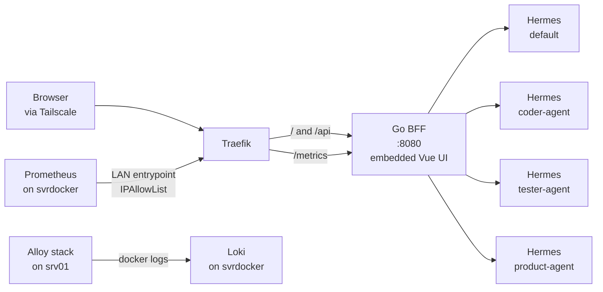

# Hermes Agent Monitoring Dashboard — Engineering Handoff

2026-09-19 · Revision 2 (post-grilling) · Product Owner: homelab operator

> Revision 2 incorporates the twenty decisions recorded in `docs/decisions/`.
> Where this document and an ADR disagree, the ADR wins. Operator actions that
> touch production live in `docs/operator-tasks.md`.

## 1. Product Summary

A read-only dashboard for monitoring the Hermes agents running on the homelab
host, with a Go BFF (backend-for-frontend) as the aggregation layer between the
browser and the Hermes API server.

### Problem

Four agents run as separate Hermes profiles (`default`, `coder-agent`,
`tester-agent`, `product-agent`) on one host. No single view answers the basic
operational questions:

- Which agent is doing something right now?
- Which tool is being called, and for how long?
- Did a run fail, hang, or wait for approval without me noticing?
- How many tokens did a session consume?

Answering those today means SSH into the host, reading logs, or asking each
agent over Telegram. Hermes ships a built-in dashboard on port 9119, but it is
per-instance and does not aggregate across profiles.

### Goals

1. One overview page showing the status of all configured profiles.
2. Per-agent drill-down: session list, run history, single-run detail.
3. Live activity feed — tool calls and sub-agent delegations visible in near
   real time.
4. Hermes credentials never reach the browser.
5. Go code worth showing as a portfolio piece: tests, observability,
   documentation.

### Non-Goals (v1)

| Out of scope | Reason |
| --- | --- |
| Chat interface with an agent | Already covered by Telegram and Open WebUI |
| Creating or editing jobs/tasks from the UI | v1 is read-only; mutations wait for v2 |
| Multi-user, roles, permission model | Single user behind Tailscale |
| Replacing Grafana | The BFF exposes metrics to Prometheus; it does not duplicate Grafana |
| Native mobile app | Responsive web is enough |
| Kanban board data | No REST endpoint in Hermes; every integration path either mounts the Hermes data volume (which holds all profile `.env` files), adds a fourth Python service, or needs the Docker socket. Deferred to v2 — see ADR-006 |
| Token *cost* and per-agent token aggregates | Requires joining usage with pricing and summing across every session on every request, which contradicts "no persistent state". v1 shows usage per session only — see ADR-007 |

### User

One person: the homelab owner operating the agents. Access is always from
inside the Tailscale network.

### Success Criteria

- The overview page fully loads in < 2 s when all profiles are healthy.
- A tool-call event appears in the UI within **one poll interval (5 s)** of the
  agent executing it (revised from "< 3 s" — see ADR-004).
- One dead profile does not break the overview — that profile shows as
  `unreachable`; the rest render normally.
- No Hermes `API_SERVER_KEY` ever appears in a response body, a log line, or
  the frontend bundle.
- The dashboard is never the cause of an HTTP 429 on Hermes.
- The dashboard never starts an agent run.

## 2. Current System Context

Everything runs on one homelab host. The engineer taking over does not need
new infrastructure beyond one container for the BFF (which also serves the
frontend) and one for log shipping.

| Component | Detail |
| --- | --- |
| Host | `srv01-rals`, Ubuntu Server 26.04 LTS, small-form-factor desktop |
| Access | Tailscale only — no port forwarding; SSH key-only |
| Reverse proxy | Traefik on Docker network `proxy-net`; listens on `127.0.0.1:80` and `<tailscale-ip>:80` (HTTP only, no TLS — WireGuard encrypts the path) |
| Hermes | Container `nousresearch/hermes-agent` version 0.21.2, **pinned by digest** (see ADR-016), compose at `/srv/stacks/hermes/compose.yaml`, CPU limit 4.0, `gateway.multiplex_profiles: true` |
| Hermes volume | Host `/srv/data/hermes` → container `/opt/data` |
| Profile data | `/srv/data/hermes/profiles/<profile>` on the host |
| Published ports | Only `9119` (built-in dashboard). The API port `8642` is reachable **only inside `proxy-net`**, and only once `API_SERVER_HOST=0.0.0.0` is set (Hermes defaults to loopback — see `docs/operator-tasks.md` § 0.2b) |

### Monitored profiles

| Profile | Role | Notes |
| --- | --- | --- |
| `default` | Lead orchestrator | Delegates implementation and testing to the other profiles |
| `coder-agent` | Coding agent | Delegates implementation to Claude Code; GitHub operations via `gh`, restricted to one dedicated account |
| `tester-agent` | Testing agent | Install/build/run tests on cloned repos; no Claude Code login, read-only GitHub access |
| `product-agent` | *(role to be documented by the operator)* | Discovered on the host during the handoff review; included in v1 (ADR-005) |

Credential isolation is why `tester-agent` exists: untrusted repository code
must not run in a context that holds valuable credentials. **The BFF design
must not weaken that separation** — one key per profile, no key used across
profiles.

### Already running

- Messaging via Telegram.
- Headless Obsidian (linuxserver.io image + Local REST API plugin +
  `mcp-obsidian`) as an extended-memory backend, also on `proxy-net`.
- Multi-agent orchestration via `delegate_task`; the built-in Kanban feature
  has been smoke-tested for dispatch to `coder-agent` and is being considered
  as a replacement.

### Available observability stack

Grafana, Loki, Prometheus, and Alloy run on a different host (`svrdocker`,
12 cores / 40 GB, resources already tight). **`svrdocker` is not on the
tailnet**; it reaches `srv01-rals` over the LAN only. No Alloy instance runs on
`srv01-rals` today. The BFF emits metrics and logs in formats this stack
consumes; it never stores metrics itself.

## 3. Architecture & Technical Decisions

A single Go binary acts as the BFF: it fans out to each Hermes profile's API
server, aggregates the results, exposes one clean API, and serves the embedded
static frontend from the same origin.



The browser never touches Hermes directly. All upstream credentials stop at the
BFF.

### Decisions and rationale

| Decision | Rationale |
| --- | --- |
| Go, one binary, no heavy framework | Owner's primary stack; deploys as one small container; suits a portfolio |
| BFF is read-only in v1 | Removes a whole risk class: the dashboard cannot start runs, cancel work, or change config |
| One HTTP client per profile, separate keys | Mandatory — since the July 2026 breaking change the `default` key is rejected on other profile prefixes |
| Parallel aggregation with `errgroup`, per-profile timeout | One slow or dead profile must not hold the whole page |
| **No automatic retries in the Hermes client** (ADR-017) | A retry inside a 2 s per-profile budget breaks the < 2 s page target; UI polling every 5 s is the retry |
| Short-TTL in-memory cache (3 s) + `singleflight` | Protects Hermes from UI polling; no Redis needed for one user |
| SSE relayed, not WebSocket | Hermes already speaks SSE; relay is simpler and `EventSource` suffices |
| **Session-based activity poller** in addition to the SSE relay (ADR-004) | Hermes has no list-runs endpoint and Telegram/delegation work likely never appears in `/v1/runs`; sessions and messages are the only cross-source signal |
| Feature detection via `GET /v1/capabilities` | Hermes is pre-1.0 and moves fast; do not hardcode feature assumptions |
| **Frontend embedded in the Go binary** (ADR-011) | One container, one Traefik router, same origin for cookies for free; every extra component on `proxy-net` is another thing to pin and patch |
| **Vue 3 + Vite + TypeScript** (ADR-012) | Owner's preference; small runtime; vue-query handles interval polling and caching |
| **BFF-issued HttpOnly session cookie** (ADR-010) | `EventSource` cannot send an `Authorization` header; a bundled bearer token would be visible to anyone on the tailnet |

### Principles that must not be violated

1. **No BFF endpoint starts an agent run.** Never use `/v1/chat/completions`,
   `/v1/responses`, `POST /v1/runs`, or the session-chat endpoints for anything,
   including health checks. Those consume `max_concurrent_runs` quota and
   tokens.
2. **Upstream keys never leave the BFF process.** Not in responses, not in logs,
   not in error messages forwarded to the client.
3. **Upstream errors are translated, never forwarded raw.** See the error
   taxonomy in § 5.
4. **Profiles are added through configuration, not code.** Adding a fifth
   profile must require only a config change and a restart.
5. **Everything committed to this repository is written in English** — code,
   comments, commit messages, docs (ADR-020).

## 4. Upstream API Contract (Hermes API Server)

All data comes from the Hermes API server, default port `8642`. Official
reference: [API Server — Hermes Agent docs](https://hermes-agent.nousresearch.com/docs/user-guide/features/api-server).

### Endpoints consumed

| Method | Path | Used for |
| --- | --- | --- |
| `GET` | `/health` | Cheap liveness probe; no readiness checks |
| `GET` | `/health/detailed` | **Gateway-wide** readiness: config, state DB, model, disk, per-platform state (`platforms["<profile>:telegram"]`), `active_api_runs`, `active_delegations`, `active_agents`. Identical on every profile prefix — see `docs/t003-findings.md` § 2 |
| `GET` | `/v1/capabilities` | Feature detection; decides which endpoints are safe to call |
| `GET` | `/v1/models` | Profile model name/alias |
| `GET` | `/api/model/options` | Authenticated providers, model list, per-model pricing (pricing unused in v1) |
| `GET` | `/api/sessions` | Session list; query `limit`, `offset`, `source`, `include_children`. **Source of the activity feed** |
| `GET` | `/api/sessions/{id}` | Single session metadata |
| `GET` | `/api/sessions/{id}/messages` | Message history; tool calls appear here |
| `GET` | `/v1/runs/{run_id}` | Poll run status without holding an SSE connection |
| `GET` | `/v1/runs/{run_id}/events` | SSE: tool-call progress, token deltas, lifecycle |
| `GET` | `/api/jobs` | Scheduled jobs |
| `GET` | `/api/jobs/{job_id}` | Job definition and last run state |
| `GET` | `/v1/skills` | Agent skill enumeration — **returns 500 on 0.21.2**; optional section |
| `GET` | `/v1/toolsets` | Configured toolsets with their concrete tools |

All of the above are read-only. **The BFF calls no POST endpoint on Hermes.**

Known gaps (verified against the documentation on 2026-09-19):

- There is **no endpoint that lists runs** (`GET /v1/runs` → 405, verified).
  `run_id` values must come from elsewhere.
- `/health/detailed` is gateway-global; only reachability/auth and the
  `platforms["<profile>:telegram"]` entry are per profile.
- Runs are "per-profile scoped … for the profile that created the run
  (including runs started via `/api/sessions/{id}/chat/stream`)". The docs
  never state that Telegram- or `delegate_task`-originated work is registered
  in `/v1/runs`. Task T-003 verifies this empirically before the feed is built.
- The per-session schema of `/api/sessions` is undocumented; it is recorded
  in `docs/t003-findings.md` § 3 (includes token counters and
  `estimated_cost_usd`/`actual_cost_usd`).

### Authentication

Bearer token per profile: `Authorization: Bearer <API_SERVER_KEY>`.

Rules to understand before writing the client:

1. `API_SERVER_KEY` **must be set in every deployment**, including loopback
   binds. Without a key the server accepts unauthenticated requests — that is
   full access to the agent toolset, including terminal commands.
2. With multi-profile routing (`gateway.multiplex_profiles: true`, **active on
   the host**) each profile is served under `/p/<profile>/`. Requests to
   `/p/<profile>/v1/...` **must use that profile's own key** from
   `~/.hermes/profiles/<profile>/.env`. The default listener's key is rejected
   on named-profile prefixes — the July 2026 breaking change.
3. A named profile without its own `API_SERVER_KEY` fails closed: its prefix is
   unreachable until a key is set.
4. Unprefixed routes and `/p/default/...` use the default profile's key.
5. Runs are per-profile. A `run_id` belonging to another profile returns
   **404, not 403**. Do not treat that 404 as a routing bug.

### Constraints that shape the design

| Constraint | Impact |
| --- | --- |
| `max_concurrent_runs` defaults to 10 per profile; exceeding it → HTTP 429 | Run-starting endpoints are forbidden in the BFF; GET endpoints do not consume this quota |
| The SSE stream sends a `: keepalive` comment line every 10 s when idle | A custom parser **must** skip lines starting with `:` |
| Unconsumed event buffers expire after 5 minutes | The SSE relay needs a reconnect strategy; runs remain visible via status polling |
| CORS is off by default | Fine — the BFF calls server-to-server. Do not set `API_SERVER_CORS_ORIGINS` |
| Responses carry `X-Content-Type-Options: nosniff` and `Referrer-Policy: no-referrer` | Informational |

### Multi-profile topology — decided

**Option A (multiplex)** is in use (ADR-001): one listener, prefix
`/p/<profile>/`. The BFF client still takes a fully configurable base URL per
profile so that moving to separate ports would be a config-only change.

## 5. BFF API Contract

All JSON endpoints live under `/api` and are read-only except the session
login. The embedded frontend is served at `/`.

### Authentication to the BFF

The operator holds one static secret, `BFF_API_KEY`. It is entered once on the
login page and never stored in the frontend bundle or `localStorage`.

| Method | Path | Function |
| --- | --- | --- |
| `POST` | `/api/auth/session` | Body `{ "key": "<BFF_API_KEY>" }`. On success sets cookie `bff_session` (random 32 bytes, `HttpOnly`, `SameSite=Strict`, 24 h, no `Secure` because Traefik terminates plain HTTP inside WireGuard). Sessions are held in memory; a BFF restart requires re-login. Constant-time key comparison; failed attempts are rate-limited per source |
| `DELETE` | `/api/auth/session` | Clears the cookie and forgets the session |

Every other `/api/*` route requires a valid `bff_session` cookie. `EventSource`
sends cookies automatically on same-origin requests, which is why the frontend
must be served from the same origin as the API (ADR-010, ADR-011).

### Read endpoints

| Method | Path | Function |
| --- | --- | --- |
| `GET` | `/api/overview` | Aggregated `/health/detailed` from all profiles; source of the main page |
| `GET` | `/api/agents` | Configured profiles + summary status |
| `GET` | `/api/agents/{profile}` | Single profile detail: health, model, capabilities, toolsets |
| `GET` | `/api/agents/{profile}/sessions` | Session list; forwards `limit`, `offset`, `source` |
| `GET` | `/api/agents/{profile}/sessions/{id}` | Session metadata + messages + token usage |
| `GET` | `/api/agents/{profile}/runs/{run_id}` | Single run status |
| `GET` | `/api/agents/{profile}/runs/{run_id}/stream` | SSE relay of the upstream run events |
| `GET` | `/api/agents/{profile}/activity/stream` | **SSE produced by the BFF** from the session poller (see "Activity feed" below) |
| `GET` | `/api/jobs` | Scheduled jobs aggregated across profiles |
| `GET` | `/healthz` | BFF liveness; no auth |
| `GET` | `/metrics` | Prometheus exposition; no BFF auth — reachable only via the Traefik LAN entrypoint with an IP allow-list |

### Example response — `GET /api/overview`

```json
{
  "generated_at": "2026-09-19T14:03:11Z",
  "agents": [
    {
      "profile": "default",
      "status": "healthy",
      "model": "hermes-agent",
      "active_runs": 1,
      "active_delegations": 2,
      "pending_completions": 0,
      "checks": { "config": "ok", "state_db": "ok", "disk": "ok" },
      "latency_ms": 42
    },
    {
      "profile": "tester-agent",
      "status": "unreachable",
      "error": { "code": "upstream_unreachable", "message": "connection refused" },
      "latency_ms": 2001
    }
  ]
}
```

Possible `status` values: `healthy`, `degraded`, `unreachable`, `unauthorized`.
Important: Hermes returns **HTTP 200 even when readiness is degraded** — the
real status is in the body's `status` and `readiness.checks` fields. Never
infer health from the HTTP status code alone.

### Error taxonomy

The BFF returns one uniform error shape: `{ "code": "...", "message": "..." }`.

| Upstream condition | BFF HTTP | `code` |
| --- | --- | --- |
| Profile not in configuration | 404 | `profile_not_found` |
| Upstream 401 | 502 | `upstream_unauthorized` |
| Upstream 404 on `run_id` | 404 | `run_not_found` |
| Upstream 429 | 503 | `upstream_busy` |
| Timeout or connection refused | 503 | `upstream_unreachable` |
| Missing/invalid BFF session | 401 | `unauthorized` |
| Invalid query parameter | 400 | `bad_request` |

Upstream error messages are sanitised before forwarding. Never include header
values, full URLs with credentials, or `.env` contents.

### SSE relay behaviour (`/runs/{run_id}/stream`)

1. Upstream `: keepalive` comment lines are forwarded verbatim so the browser
   connection does not idle out.
2. When the client disconnects, the request context is cancelled and the
   upstream connection **must** be closed — dangling connections accumulate.
3. A mid-stream upstream failure is sent as a named `error` event, then the
   stream is closed cleanly. Never just drop the connection.
4. Reconnect is the frontend's responsibility; the BFF buffers nothing.

Events the frontend handles: `tool.started`, `tool.completed`,
`subagent.start`, `subagent.complete`, `assistant.delta`, `approval.request`,
and the terminal `run.completed` / `run.failed` / `run.cancelled` /
`run.interrupted`.

### Activity feed (`/activity/stream`) — ADR-004, ADR-018

Because `/v1/runs` only knows about API-initiated runs, the BFF derives a
cross-source feed from sessions:

| Parameter | Value | Reason |
| --- | --- | --- |
| Lifecycle | **Lazy**: the poller for a profile starts on its first SSE subscriber and stops 30 s after the last one leaves | A dashboard nobody is looking at puts zero load on Hermes |
| Poll interval | 5 s, configurable | Matches the minimum UI polling interval |
| Sessions tracked | Only sessions with `updated_at` in the last 10 minutes, at most 10 per profile | Bounds fan-out and cursor memory |
| Messages fetched | Only those after the per-session cursor (exact mechanism decided after T-003 shows the `/messages` shape) | Incremental reads |
| Memory | One cursor per tracked session; dropped when the session leaves the window | No unbounded growth |
| Profile unreachable | Emit a named `error` event to subscribers, keep trying on the next tick | Same semantics as the run relay |

Emitted events mirror the run-event vocabulary where possible
(`tool.started`, `tool.completed`, `subagent.start`, `subagent.complete`,
`session.updated`) and always carry `profile` and `session_id`.

## 6. Data & Event Model

The BFF holds no persistent state. All data is fetched from Hermes on demand
with a short-TTL in-memory cache; the only in-memory state beyond the cache is
login sessions and poller cursors. There is no database in v1.

### Core entities

| Entity | Key | Source |
| --- | --- | --- |
| Agent | `profile` (string) | BFF config + `/health/detailed` |
| Session | `profile` + `session_id` | `/api/sessions` |
| Run | `profile` + `run_id` | `/v1/runs/{id}` |
| Job | `profile` + `job_id` | `/api/jobs` |

`profile` is part of the composite key for **every** entity. A `run_id` is not
globally unique and must never be treated as such — another profile's run
returns 404.

### Run status

From the Hermes documentation: `started`, `running`, `stopping`, `completed`,
`failed`, `cancelled`, `waiting_for_approval`, `interrupted`.

Notes the UI must handle:

- `interrupted` happens when the gateway dies while a run is active. Runs never
  survive as `running` across a restart, so this status is real, not a bug.
- `stopping` persists until the executor actually exits; do not show it as
  finished.
- Terminal statuses are kept only briefly for polling. Old runs stop being
  queryable.

### Tool event shape

`tool.started` carries `tool` and a `preview` of the arguments.
`tool.completed` carries `tool`, `duration` (seconds), `error`, and a
`preview` of the result.

Two things that matter for the UI:

1. The `error` flag reflects the tool's own outcome — non-zero `exit_code`, a
   structured `{"error": ...}` result, or a denied approval. Show it as a tool
   failure, not a run failure.
2. `preview` has already passed forced secret redaction and is cut at 500
   characters. The UI must not promise full output; link to the session detail
   for that.

### Sub-agent events

`subagent.start` and `subagent.complete` appear when an agent delegates work —
directly relevant to the orchestrator → `coder-agent` / `tester-agent` setup.
The `subagent.complete` payload carries the child status, summary, duration,
token/cost numbers, `child_session_id` for correlation, and the batch
`delegation_id`.

Per-tool events from the child (`subagent.tool`, progress ticks) are **not**
forwarded by Hermes — by design. Do not build UI that depends on them.

## 7. Backlog & Milestones

Work is done by one engineer with the operator reviewing; the original
senior/junior split is dropped. Tickets are delivered in milestone order, one
commit per ticket straight to `main`, test-first (ADR-019).

### M0 — Prerequisites (before the first line of Go)

| ID | Task | Acceptance criteria |
| --- | --- | --- |
| T-001 | Decide topology | **Done** — multiplex (ADR-001) |
| T-002 | Confirm `API_SERVER_KEY` per profile incl. `product-agent` | **Done** — keys generated for the three named profiles; cross-profile key returns 401; `API_SERVER_HOST=0.0.0.0` set |
| T-003 | `scripts/collect-fixtures.sh` + fixtures for 4 profiles × 14 endpoints, redacted | **Done** — `testdata/fixtures/`, findings in `docs/t003-findings.md`; Telegram work confirmed invisible to `/v1/runs` |
| T-004 | Verify `/v1/capabilities` per profile | **Done** — identical feature map on all four profiles (fixtures); `skills_api: true` despite `/v1/skills` 500 |
| T-005 | Rewrite this PRD, write ADRs, scaffold repo, `git init`, public GitHub repo | **Done** — This document; `docs/decisions/`; CI skeleton green on an empty module |
| T-006 | Operator pins the Hermes image digest | Checklist 0.1 ticked |

### M1 — BFF core (+ observability from day one)

| ID | Task | Acceptance criteria |
| --- | --- | --- |
| T-101 | Go scaffold: routing, config loader, structured logging, graceful shutdown | **Done** — `go run ./cmd/bff` starts; `/healthz` returns 200; config validated at start; referenced env vars must be non-empty |
| T-102 | Hermes client package: one instance per profile, bearer auth, per-profile timeout, **no automatic retries** | **Done** — `httptest` unit tests; key never appears in logs or errors; base URL fully configurable |
| T-103 | `GET /api/agents` | **Done** — Returns configured profiles with summary status |
| T-104 | `GET /api/overview` — parallel fan-out + aggregation | **Done** — One dead profile does not fail the response; per-profile timeout enforced; tests cover mixed healthy/dead |
| T-105 | TTL cache + `singleflight` | **Done** — TTL configurable; cache hit does not call upstream; concurrent misses coalesce; tests prove both |
| T-106 | Auth: `POST/DELETE /api/auth/session`, cookie middleware | **Done** — Missing/invalid cookie → 401 `unauthorized`; `/healthz` and `/metrics` exempt; constant-time key compare; login rate-limited |
| T-107 | Error taxonomy and upstream mapping | **Done** — Every row of the taxonomy table has a test |
| T-108 | `/metrics` (moved from T-401) | **Done** — Upstream latency per profile, error ratio, active-runs gauge, cache hit ratio, poller subscriber gauge |
| T-109 | Structured JSON logs (moved from T-402) | **Done** — One line per request with `profile`, `path`, `status`, `duration_ms`; no credentials; key-redaction test |
| T-110 | `GET /api/agents/{profile}` (in the § 5 contract, missing from the original backlog) | **Done** — Health card + capabilities, toolsets, models, skills; a failing optional section becomes `null` plus a `warnings` entry instead of failing the page |

### M2 — Sessions, runs, feed, jobs

| ID | Task | Acceptance criteria |
| --- | --- | --- |
| T-201 | `GET /api/agents/{profile}/sessions` with pagination passthrough | **Done** — `limit`/`offset`/`source` forwarded; out-of-range values → 400 `bad_request` |
| T-202 | `GET /api/agents/{profile}/sessions/{id}` + messages + usage | **Done** — Metadata, messages, and token usage merged into one response |
| T-203 | `GET /api/agents/{profile}/runs/{run_id}` | **Done** — Upstream 404 → `run_not_found`, not 500 |
| T-204 | SSE relay `/runs/{run_id}/stream` | **Done** — Keepalive forwarded; upstream closed when client leaves; mid-stream failure becomes an `error` event; tested against a fake upstream |
| T-205 | Session poller + `/activity/stream` (ADR-004/018) | **Done** — Lazy start/stop; bounded sessions and cursors; events carry `profile` + `session_id`; tested with a fake upstream advancing over time |
| T-206 | `GET /api/jobs` aggregated across profiles (was T-301) | **Done** — Each job carries its `profile`; a dead profile does not fail the response |

### M3 — Frontend (Vue 3)

| ID | Task | Acceptance criteria |
| --- | --- | --- |
| T-301 | Vite + Vue 3 + TS + vue-query + vue-router + Tailwind skeleton; login page; embed pipeline | **Done** — `go build` produces one binary serving `/` and `/api`; login sets the cookie |
| T-302 | Overview page | **Done** — All profiles render; `unreachable`/`unauthorized` shown clearly, not as an error screen; polling ≥ 5 s |
| T-303 | Agent detail page: sessions and runs | **Done** — Navigation from overview works; pagination works; token usage per session visible |
| T-304 | Live activity feed via `EventSource` on `/activity/stream`, plus run detail on `/runs/{id}/stream` | **Done** — Tool events render in real time; automatic reconnect after disconnect; resync via status polling |

### M4 — Deployment & documentation

| ID | Task | Acceptance criteria |
| --- | --- | --- |
| T-401 | Multi-stage Dockerfile (Node build → Go build → distroless) | **Done** (13 MB) — Final image < 30 MB; non-root user; `linux/amd64` |
| T-402 | GitHub Actions: vet, lint, test, build, push to GHCR | **Done** — Green on `main`; image tagged by SHA and `latest` |
| T-403 | Compose stack `hermes-dashboard` on `proxy-net` with Traefik labels | **Done** (deploy/hermes-dashboard) — Reachable over Tailscale; BFF port not published; resource limits set |
| T-404 (superseded) | Traefik LAN entrypoint + `IPAllowList` patch for `/metrics` (ADR-008) | **Written** (deploy/traefik) — operator applies — `deploy/traefik/` documented; `svrdocker` scrapes successfully; other LAN hosts get 403 |
| T-405 | Separate `alloy` stack (ADR-009) | **Written** (deploy/alloy) — operator applies — `deploy/alloy/`; BFF JSON logs visible in Loki |
| T-406 | Grafana dashboard JSON | **Done** — `deploy/grafana/hermes-bff.json` in repo |
| T-407 | README + operator runbook | **Done** — A new engineer can run locally from the README alone; "tested against Hermes digest …" line present |
| T-408 | Acceptance run | **Pending** — docs/acceptance-v1.md — `docs/acceptance-v1.md` records the result of every test in § 10 |

## 8. Setup, Configuration & Deployment

### Hermes-side prerequisites

For each profile, in `~/.hermes/profiles/<profile>/.env` (the `default` profile
uses `~/.hermes/.env`):

```
API_SERVER_ENABLED=true
API_SERVER_KEY=<unique key per profile>
```

Additionally, in the `default` profile's `.env` only (single multiplexed listener):

```
API_SERVER_HOST=0.0.0.0
```

Without it the server binds to loopback inside the container and no other
container — including the BFF — can reach it.

Do not set `API_SERVER_CORS_ORIGINS`. The BFF calls server-to-server, so CORS is
not needed and enabling it only widens the attack surface.

`gateway.multiplex_profiles: true` is already set in `config.yaml`.

Verification before writing code (from a workstation with the port-forward
described in `docs/operator-tasks.md` § 0.3):

```
curl -H "Authorization: Bearer $HERMES_KEY_DEFAULT" http://127.0.0.1:8642/health/detailed
curl -H "Authorization: Bearer $HERMES_KEY_CODER"   http://127.0.0.1:8642/p/coder-agent/v1/capabilities
```

The second call with `$HERMES_KEY_DEFAULT` **must** return 401. If it does not,
the configuration is wrong.

### BFF configuration

Profiles are defined in a config file, not in code. Suggested shape
(`config.yaml`):

```yaml
server:
  addr: ":8080"
  read_timeout: 10s
auth:
  key_env: BFF_API_KEY
  session_ttl: 24h
cache:
  ttl: 3s
activity:
  poll_interval: 5s
  window: 10m
  max_sessions_per_profile: 10
  idle_stop_after: 30s
upstream:
  timeout: 2s
  profiles:
    - name: default
      base_url: http://hermes:8642
      key_env: HERMES_KEY_DEFAULT
    - name: coder-agent
      base_url: http://hermes:8642/p/coder-agent
      key_env: HERMES_KEY_CODER
    - name: tester-agent
      base_url: http://hermes:8642/p/tester-agent
      key_env: HERMES_KEY_TESTER
    - name: product-agent
      base_url: http://hermes:8642/p/product-agent
      key_env: HERMES_KEY_PRODUCT
```

Keys are **never** written in the config file — only the name of the
environment variable that holds them. The application fails at start if a
referenced variable is empty.

### Environment variables

| Variable | Required | Notes |
| --- | --- | --- |
| `BFF_API_KEY` | yes | The secret typed into the login page |
| `HERMES_KEY_DEFAULT` | yes | Key for profile `default` |
| `HERMES_KEY_CODER` | yes | Key for profile `coder-agent` |
| `HERMES_KEY_TESTER` | yes | Key for profile `tester-agent` |
| `HERMES_KEY_PRODUCT` | yes | Key for profile `product-agent` |
| `LOG_LEVEL` | no | Default `info` |

### Deployment

One new compose stack at `/srv/stacks/hermes-dashboard/`, joined to the
existing `proxy-net` so Traefik can reach it and so the BFF can call the Hermes
container by service name. A second, separate stack at `/srv/stacks/alloy/`
ships container logs to Loki.

Rules:

- The BFF port is **not** published on the host. Access only through Traefik.
- The container runs as a non-root user.
- Resource limits are set conservatively — the host also runs Hermes with a
  CPU limit of 4.0.
- No Traefik route is exposed to the internet. Access stays on Tailscale; the
  LAN entrypoint serves `/metrics` only, behind an IP allow-list.
- Images are built by GitHub Actions and pulled from GHCR (ADR-015). A manual
  `docker save | ssh docker load` path is documented in the runbook as a
  fallback.

### Local development

From another machine, open an SSH port-forward to the Hermes container over
Tailscale (`docs/operator-tasks.md` § 0.3) and point `base_url` at
`http://127.0.0.1:8642`. Keys are loaded with `read -rs`, never from a file.
The fixtures from T-003 let most work run without a live Hermes at all.

## 9. Risks & Assumptions

### Risks

| Risk | Impact | Mitigation |
| --- | --- | --- |
| Hermes is pre-1.0 and moves fast — v0.19.0 → v0.20.0 spanned roughly 3,650 commits | Endpoints or payload shapes change between image pulls | Image pinned by digest; upgrades re-run the fixture script and diff; `/v1/capabilities` feature detection; contract fixtures in tests |
| The API server grants full access to the agent toolset, including terminal commands — and with `terminal.backend: local` those run unsandboxed inside the Hermes container | A leaked key means full access to the Hermes container, including every profile's `.env` | Key per profile, never leaves the BFF, never logged; port 8642 visible only to containers on the Docker networks, never published; a sandboxed terminal backend is recommended on the Hermes side |
| CVE history on the project, including auth bypass and IDOR | Public exposure is dangerous | Never create an internet-facing Traefik route for Hermes or the BFF |
| Aggressive UI polling | CPU load on a constrained host | TTL cache mandatory; UI polling interval ≥ 5 s; activity poller is lazy |
| SSE event buffers expire after 5 minutes without a consumer | A backgrounded frontend loses events | UI reconnects and resyncs via run status polling |
| Single host runs both Hermes and the BFF | Resource contention | Container resource limits; the BFF must stay light |
| Telegram/delegation work may be invisible to `/v1/runs` | The "live run" view would only show API-initiated runs | Session-based activity poller (ADR-004); verified in T-003 before M2 |
| Plain HTTP between Traefik and the browser | Cookie cannot be `Secure` | Accepted: the only path is WireGuard-encrypted Tailscale; recorded in ADR-010 |

### Assumptions

1. All profiles run on the same host and are reachable by the BFF through the
   internal Docker network.
2. There is exactly one user; no permission model is needed.
3. Access is always from inside Tailscale, so a single static secret plus a
   BFF-issued session cookie is sufficient.
4. Hermes still provides the § 4 endpoints with the same shapes when
   implementation starts — re-verified by T-003.

### Resolved questions

| # | Question | Resolution |
| --- | --- | --- |
| Q1 | Multiplex or separate ports? | Multiplex — ADR-001 |
| Q2 | Kanban in v1? | Deferred to v2 — ADR-006 |
| Q3 | Token cost in v1? | Usage per session only; cost and aggregates in v2 — ADR-007 |
| Q4 | Frontend framework? | Vue 3 — ADR-012 |
| Q5 | Metrics retention? | Existing Prometheus on `svrdocker`; BFF stores nothing — ADR-008 |

## 10. Definition of Done

### Per ticket

- [ ] Acceptance criteria in the backlog table met
- [ ] Unit tests for new logic; error paths tested, not only the happy path
- [ ] `go vet` and `golangci-lint` clean
- [ ] No credentials in logs or responses
- [ ] README updated if config or the way to run changed
- [ ] Everything in English

### End-to-end acceptance for v1

Run manually against a live Hermes before v1 is declared done; results go in
`docs/acceptance-v1.md`.

1. **Overview** — open the dashboard; all four profiles show the correct
   status and active-run counts.
2. **Degradation** — stop the Hermes container, reload; all profiles show
   `unreachable`, the page does not crash, the error message is clear.
3. **Partial degradation** — blank one profile's `API_SERVER_KEY` in the BFF
   env and restart the BFF; only that profile shows `unauthorized`, the rest
   are normal. (Replaces the "stop one gateway" test, which does not apply to
   the multiplex topology.)
4. **Live feed** — trigger a task via Telegram, open the agent's activity feed;
   tool events appear within one poll interval.
5. **Delegation** — ask the orchestrator to delegate to `coder-agent`;
   `subagent.start` and `subagent.complete` appear with duration and summary.
6. **Profile isolation** — take a `run_id` owned by `coder-agent`, request it
   via the `tester-agent` path; the result is 404 `run_not_found`, not 500 and
   not a data leak.
7. **Credential leakage** — grep all responses and logs for each
   `API_SERVER_KEY` value and for `BFF_API_KEY`; zero hits.
8. **Auth** — call `/api/overview` without the cookie; 401. Log in with a wrong
   key; 401 and rate-limited after repeated attempts.
9. **Not a run trigger** — leave the dashboard open for 30 minutes without
   interaction, then closed for 30 minutes; the run count on Hermes does not
   increase, and with the dashboard closed the BFF makes zero upstream calls
   (poller is lazy).
10. **Metrics and logs** — Prometheus on `svrdocker` scrapes `/metrics`; the
    Grafana dashboard shows data; Loki shows BFF request logs.

Item 9 is the most important. A dashboard that accidentally starts agent runs
would burn tokens, consume `max_concurrent_runs` quota, and break the very
thing it is supposed to monitor.

## 11. Post-v1 additions

Changes made after v1 shipped (2026-09-20), too small to warrant a PRD
revision but worth a one-line pointer here. Full rationale lives in the
linked ADR.

| Feature | Summary | ADR |
| --- | --- | --- |
| Floor view (v1.1) | `/floor`: each profile illustrated as a worker at a station (idle/working/delegating/error/offline), with a line to whichever profile it's currently delegated to. Pure frontend, built from `/api/overview` and the existing activity streams — no BFF change. | [ADR-021](decisions/021-floor-view.md) |
